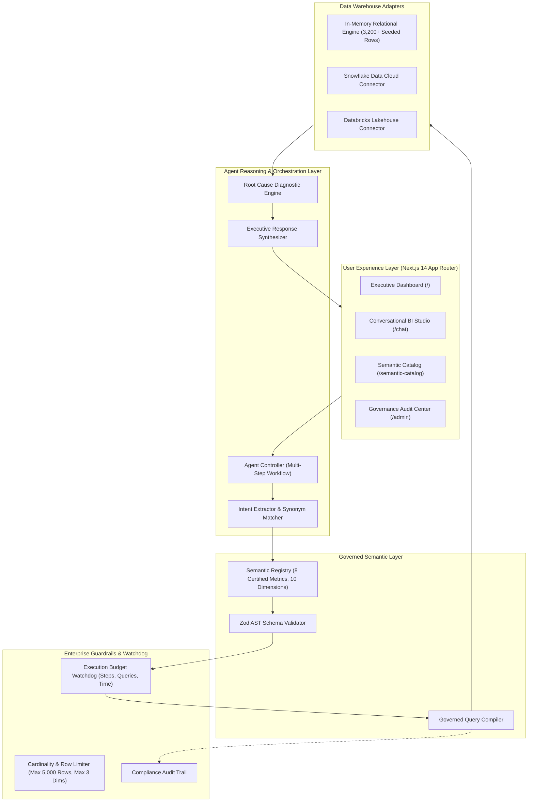

# MetricMind — Agentic Semantic BI Engine

<p align="center">
  
  
  
  
  
</p>

> **Governed, deterministic, and explainable conversational Business Intelligence powered by Semantic Layers, Governance Watchdogs, and Multi-Step AI Reasoning.**

---

## 📌 Executive Summary & Architectural Guarantee

Traditional Text-to-SQL assistants fail in enterprise environments because:
1. **Hallucinated SQL**: LLMs fabricate non-existent tables, incorrect joins, and phantom column names.
2. **Metric Inconsistency**: Different phrasing yields different formulas for critical KPIs (e.g., `gross_margin`, `churn`, `ARR`).
3. **Security Risks**: Exposing raw database schemas to LLMs introduces SQL injection and data leakage vulnerabilities.
4. **Un-Traceable Arithmetic**: LLMs generate numbers directly in text without querying actual underlying database rows.

### 🛡️ The MetricMind Golden Rule
> **The LLM is NEVER given direct access to generate raw SQL or query warehouse tables directly.**
>
> `Natural Language Question`  
> $\downarrow$  
> `Multi-Step Agent Controller`  
> $\downarrow$  
> `Governed Semantic Layer Registry (Locked Formulas & Synonyms)`  
> $\downarrow$  
> `Governance Watchdog & Policy Validator (Budget & Cardinality Guardrails)`  
> $\downarrow$  
> `Safe SQL Compiler (Parameterized, Read-Only, GROUP BY, LIMIT)`  
> $\downarrow$  
> `Enterprise Warehouse (In-Memory / Snowflake / Databricks)`  
> $\downarrow$  
> `Root Cause Diagnostic Breakdown Engine`  
> $\downarrow$  
> `Structured Executive Synthesis + Interactive Recharts Visualizations`

---

## 🏛️ System Architecture



---

## 🎯 Flagship Diagnostic Use Case

### User Prompt:
> *"Why did our European margins drop last quarter?"*

### Autonomous Multi-Step Reasoning Trace:
1. **Intent Extraction**: Identifies the primary metric (`gross_margin`), geographical filter (`region = 'Europe'`), and time range (`2024-Q1` through `2024-Q4`).
2. **Semantic Registry Lookup**: Resolves official formula `(revenue - cost) / revenue` and checks allowed dimensions (`region`, `quarter`, `product_category`, etc.).
3. **Primary Governed Query**: Emits strongly-typed `SemanticQuery` AST $\rightarrow$ compiles to parameterized SQL $\rightarrow$ executes against warehouse.
4. **Variance Detection**: Computes that European gross margin contracted from **42.2% in Q3 to 38.5% in Q4 ($-3.7\text{ pp}$)**.
5. **Automated Secondary Breakdown**:
   - **Cost Driver Diagnostic**: Automatically breaks down cost components. Discovers **Shipping & Logistics surged +9.4% (€62.1K $\rightarrow$ €68.0K)** and Material Cost rose +3.8%, while Revenue stayed steady (+1.1%).
   - **Geographic Diagnostic**: Discovers **Germany** experienced the steepest localized contraction ($-5.3\text{ pp}$) due to freight bottlenecks.
6. **Synthesis & Visualization**:
   - Executive briefing with observed facts, interpretations, and hypotheses.
   - Interactive Recharts Line Trend chart & Cost Driver Bar chart.
   - Searchable, sortable raw data table with CSV export.
   - **5-Tab Lineage & Transparency Drawer** (Metric Definition, Semantic AST, API Payload, Compiled SQL, Data Provenance).

---

## 📊 Governed Metric & Dimension Registry

### Certified Business Metrics

| Metric | Business Label | Canonical Formula | SQL Expression | Category | Data Type |
| :--- | :--- | :--- | :--- | :--- | :--- |
| **`revenue`** | Net Revenue | `SUM(revenue)` | `SUM(revenue)` | Financial | Currency |
| **`cost`** | Total Cost | `SUM(cost)` | `SUM(cost)` | Financial | Currency |
| **`gross_profit`** | Gross Profit | `revenue - cost` | `SUM(revenue) - SUM(cost)` | Financial | Currency |
| **`gross_margin`** | Gross Margin | `(revenue - cost) / revenue` | `CAST(SUM(revenue) - SUM(cost) AS FLOAT) / NULLIF(SUM(revenue), 0)` | Financial | Percentage |
| **`orders`** | Order Count | `COUNT(order_id)` | `COUNT(order_id)` | Operations | Integer |
| **`aov`** | Average Order Value | `revenue / orders` | `CAST(SUM(revenue) AS FLOAT) / NULLIF(COUNT(order_id), 0)` | Operations | Currency |
| **`shipping_cost`** | Freight & Shipping | `SUM(shipping_cost)` | `SUM(shipping_cost)` | Logistics | Currency |
| **`material_cost`** | Material Cost | `SUM(material_cost)` | `SUM(material_cost)` | Operations | Currency |

### Certified Breakdown Dimensions
- **Time**: `date`, `year`, `quarter`, `month`
- **Geography**: `region`, `country`
- **Product**: `product_category`, `product`
- **Operations**: `customer_segment`, `sales_channel`

---

## 🔒 Enterprise Governance Guardrails

The Governance Engine (`lib/governance/engine.ts`) enforces strict runtime budgets:

```typescript
export const GOVERNANCE_LIMITS = {
  maxAgentSteps: 8,               // Protects against runaway reasoning loops
  maxQueriesPerQuestion: 5,       // Protects warehouse compute quotas
  maxRowsReturned: 5000,          // Auto-caps large result sets for bandwidth & memory
  maxQueryExecutionTimeMs: 10000, // Enforces query timeout safety
  maxBreakdownDimensions: 3,      // Prevents high-cardinality Cartesian explosions
};
```

All query transactions are recorded with timestamps, execution latencies, compiled SQL, and status in the **Governance Audit Center** (`/admin`).

---

## 💻 Tech Stack

- **Framework**: [Next.js 14](https://nextjs.org/) (App Router, Server & Client Components)
- **Language**: [TypeScript](https://www.typescriptlang.org/) (Strict Mode)
- **Styling**: [Tailwind CSS](https://tailwindcss.com/) with Dark/Light Theme System
- **Charts & Visualizations**: [Recharts](https://recharts.org/) (Line, Bar, Area, Composite)
- **Validation**: [Zod](https://zod.dev/) Schema AST Validation
- **Icons**: [Lucide React](https://lucide.dev/)
- **Testing**: Automated Integration & Unit Suite with custom test runner

---

## 🚀 Quick Start & Installation

### 1. Clone Repository
```bash
git clone https://github.com/Kajal09kumari/metricmind.git
cd metricmind
```

### 2. Install Dependencies
```bash
npm install
```

### 3. Run Development Server
```bash
npm run dev
```
Open [http://localhost:3000](http://localhost:3000) in your browser.

### 4. Run Automated Test Suite (27/27 Tests)
```bash
npm test
```

---

## 🔌 API Reference

### 1. `POST /api/chat`
Executes the full agentic semantic BI reasoning workflow.
```json
// Request
{
  "question": "Why did our European margins drop last quarter?"
}

// Response
{
  "success": true,
  "state": {
    "question": "Why did our European margins drop last quarter?",
    "steps": [...],
    "finalAnswer": "Europe gross margin declined by 3.7 percentage points in Q4...",
    "primaryResult": { ... },
    "secondaryResults": [ ... ],
    "visualization": { "type": "line", ... },
    "auditRecord": { "status": "success", "executionTimeMs": 1066 }
  }
}
```

### 2. `GET /api/semantic`
Returns all certified metrics and dimensions in the catalog.
```bash
curl http://localhost:3000/api/semantic
```

### 3. `POST /api/query`
Direct governed query endpoint executing structured `SemanticQuery` AST.
```json
{
  "metric": "gross_margin",
  "dimensions": ["quarter"],
  "filters": [{ "dimension": "region", "operator": "equals", "value": "Europe" }],
  "timeRange": { "start": "2024-Q1", "end": "2024-Q4" }
}
```

### 4. `GET /api/audit`
Returns query compliance audit records and warehouse execution statistics.

---

## ☁️ Enterprise Warehouse Configuration

To connect external cloud warehouses, configure `.env.local`:

### Snowflake
```env
WAREHOUSE_PROVIDER=snowflake
SNOWFLAKE_ACCOUNT=xy12345.us-east-1
SNOWFLAKE_USERNAME=analytics_svc
SNOWFLAKE_PASSWORD=your_secret_password
SNOWFLAKE_DATABASE=ENTERPRISE_EDW
SNOWFLAKE_SCHEMA=CORE_SALES
SNOWFLAKE_WAREHOUSE=ANALYTICS_WH
```

### Databricks
```env
WAREHOUSE_PROVIDER=databricks
DATABRICKS_HOST=https://adb-123456789.azuredatabricks.net
DATABRICKS_TOKEN=dapi_your_token
DATABRICKS_WAREHOUSE_ID=ab1234c5678d90e
```

---

## 📄 License

MIT © 2026 MetricMind Contributors. Built with ❤️ for Governed Enterprise Intelligence.
